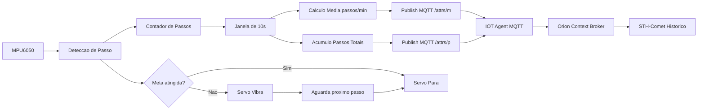

# Pulseira Care Plus

> Dispositivo IoT vestível para monitoramento de atividade física com alertas inteligentes via vibração e integração com plataforma FIWARE.

---

## Integrantes

| Nome | RM |
|------|----|
| Felipe Menezes | RM 566607 |
| Gabriel Ardito | RM 568318 |
| João Sarracine | RM 567407 |
| João Gozado | RM 568166 |

---

## Descrição do Projeto

A **Pulseira Care Plus** é um dispositivo vestível baseado em ESP32 que monitora a atividade física do usuário através de um acelerômetro MPU6050. O sistema conta passos em tempo real, calcula a média de passos por minuto e publica esses dados via MQTT para a plataforma FIWARE, onde ficam disponíveis para consulta e análise histórica.

Caso o usuário não atinja a meta de passos dentro de uma janela de tempo configurável, a pulseira aciona um servo motor que simula vibração — funcionando como um alerta tátil para incentivar o movimento.

---

## Arquitetura

```
┌─────────────────────────────────────────────────────────────┐
│                     PULSEIRA CARE PLUS                      │
│                                                             │
│   ┌──────────┐    I2C     ┌──────────┐                      │
│   │ MPU6050  │ ─────────> │          │   PWM   ┌─────────┐  │
│   │  (IMU)   │            │  ESP32   │ ──────> │  Servo  │  │
│   └──────────┘            │          │         └─────────┘  │
│                           └────┬─────┘                      │
└────────────────────────────────│────────────────────────────┘
                                 │ WiFi / MQTT
                                 ▼
                    ┌────────────────────────┐
                    │    Broker MQTT         │
                    │    (porta 1883)        │
                    └────────────┬───────────┘
                                 │
                    ┌────────────▼───────────┐
                    │   IOT Agent MQTT       │
                    │   (porta 4041)         │
                    └────────────┬───────────┘
                                 │
                    ┌────────────▼───────────┐
                    │  Orion Context Broker  │
                    │   (porta 1026)         │
                    └────────────┬───────────┘
                                 │
                    ┌────────────▼───────────┐
                    │      STH-Comet         │
                    │  Histórico de dados    │
                    │   (porta 8666)         │
                    └────────────────────────┘
```

---

## Componentes

| Componente | Função |
|------------|--------|
| ESP32 DevKit C v4 | Microcontrolador principal — processa dados, gerencia WiFi e MQTT |
| MPU6050 (IMU) | Acelerômetro + giroscópio — detecta movimento e conta passos |
| Servo Motor | Simula vibração como alerta tátil ao usuário |

---

## Conexões

### MPU6050 → ESP32

| MPU6050 | ESP32 | Cor |
|---------|-------|-----|
| VCC | 3V3 | Vermelho |
| GND | GND | Preto |
| SDA | GPIO 21 | Verde |
| SCL | GPIO 22 | Magenta |

### Servo Motor → ESP32

| Servo | ESP32 | Cor |
|-------|-------|-----|
| GND | GND | Preto |
| V+ | 5V | Vermelho |
| PWM | GPIO 19 | Verde |

---

## Integração MQTT / FIWARE

### Identificação do dispositivo

```
Device ID:   step001
Entity Name: urn:ngsi-ld:Pedometer:001
Entity Type: Pedometer
```

### Tópicos MQTT

| Direção | Tópico | Descrição |
|---------|--------|-----------|
| Publish | `/TEF/step001/attrs/p` | Passos totais na janela |
| Publish | `/TEF/step001/attrs/m` | Média de passos por minuto |
| Subscribe | `/TEF/step001/cmd` | Comandos recebidos (ex: `step001@agua\|`) |

### Atributos no Orion

| object_id | Nome | Tipo | Descrição |
|-----------|------|------|-----------|
| `p` | `steps` | Integer | Passos acumulados na janela atual |
| `m` | `steps_per_minute` | Float | Média de passos/min nos últimos 10s |

### Fluxo de dados



---

## Lógica de Funcionamento

### Detecção de passos

O MPU6050 fornece aceleração nos três eixos (X, Y, Z). O algoritmo calcula a variação brusca do vetor resultante (`delta = total - anterior`). Quando essa variação ultrapassa o threshold de `3 m/s²` com intervalo mínimo de `500ms` entre passos, um passo é registrado.

Esse método de detecção por delta é mais robusto que threshold absoluto — funciona independente da orientação do dispositivo.

### Janela de meta

| Parâmetro | Valor padrão | Variável |
|-----------|-------------|----------|
| Meta de passos | 10 passos | `PASSOS_MINIMOS` |
| Duração da janela | 30 segundos | `JANELA_MS` |
| Intervalo de publicação | 10 segundos | `PUBLISH_MS` |

Ao encerrar a janela, se o usuário não atingiu a meta, o servo inicia a vibração. A vibração para imediatamente ao detectar o primeiro passo.

### Comandos recebidos

O dispositivo escuta o tópico `/TEF/step001/cmd`. O formato do payload segue o padrão UltraLight do FIWARE:

```
step001@agua|
```

Comandos implementados:

| Comando | Comportamento |
|---------|--------------|
| `agua` | (estrutura implementada, vibração específica a definir) |

---

## Estrutura do Repositório

```
pulseira-care-plus/
├── firmware/
│   └── sketch.ino                               # Código do ESP32
├── postman/
│   └── FIWARE-Pedometro.postman_collection.json # Collection Postman
├── wokwi/
│   └── diagram.json                             # Diagrama de conexões Wokwi
└── README.md
```

---

## Como Executar

### 1. Simulação (Wokwi)

1. Acesse [wokwi.com](https://wokwi.com/projects/462390704231379969) e crie um novo projeto ESP32
2. Importe o `diagram.json` da pasta `wokwi/`
3. Cole o conteúdo de `firmware/sketch.ino`
4. Ajuste `BROKER_MQTT` no código para o IP do seu servidor
5. Clique em **Start Simulation**
6. Para simular passos: clique no MPU6050 e mova o slider do eixo Z abruptamente

### 2. Configuração do FIWARE

Importe a collection `FIWARE-Pedometro.postman_collection.json` no Postman e execute na ordem:

```
1. IOT Agent → 1. Health Check
2. IOT Agent → 2. Provisioning Service Group
3. IOT Agent → 3. Provisioning Pedômetro
4. [Inicie o firmware]
5. Orion → 2. Get Estado Atual
6. STH-Comet → 2. Subscrever Passos Totais
7. STH-Comet → 3. Subscrever Média Passos/min
8. STH-Comet → 4 e 5. Consultar histórico
```

> Configure a variável `{{url}}` no Postman Environment com o IP do servidor FIWARE.

---

## Dependências (firmware)

```cpp
#include <Adafruit_MPU6050.h>
#include <Adafruit_Sensor.h>
#include <Wire.h>
#include <WiFi.h>
#include <PubSubClient.h>
```

Instale via Arduino Library Manager:
- `Adafruit MPU6050`
- `Adafruit Unified Sensor`
- `PubSubClient` (Nick O'Leary)

---